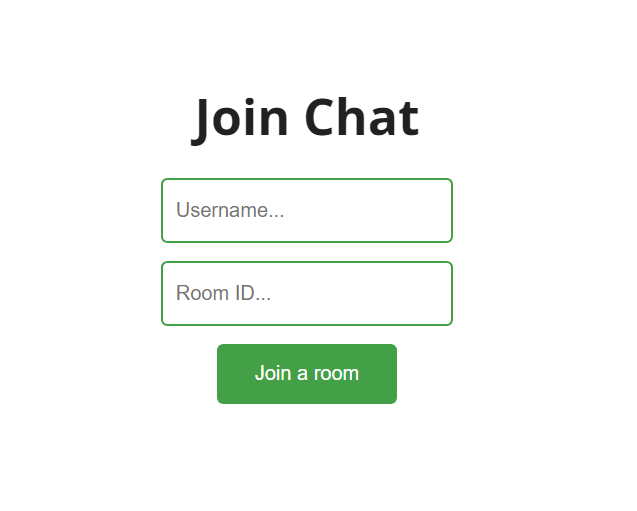
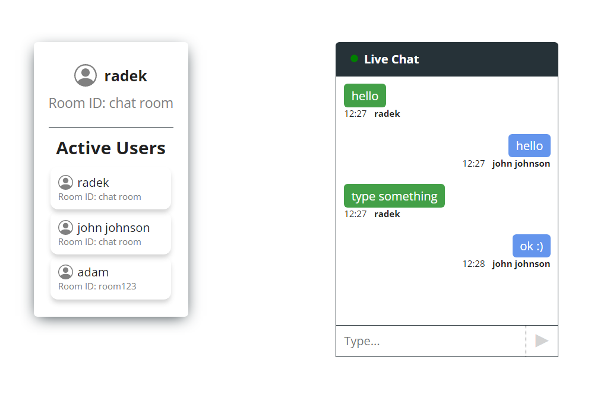

# Chat App
A Realtime Chat App in ReactJS, NodeJS, Socket.IO and SCSS
## Installation and Setup Instructions
Clone down this repository:
```bash
git clone https://github.com/rnycz/chat-app.git
```
Go to server folder:
```bash
cd server
```
Installation:
```bash
npm install
```
Start Server:
```bash
npm start
```
Do the same in client folder:
```bash
cd client -> npm install -> npm start
```
Visit App:
```bash
http://localhost:3000/
```
## Project Screenshots
Join the chat, enter your username and room ID. <br />
 <br />
To join the chat with another user, open the page in a new tab and join the selected room. <br />
<br />
Now you can chat